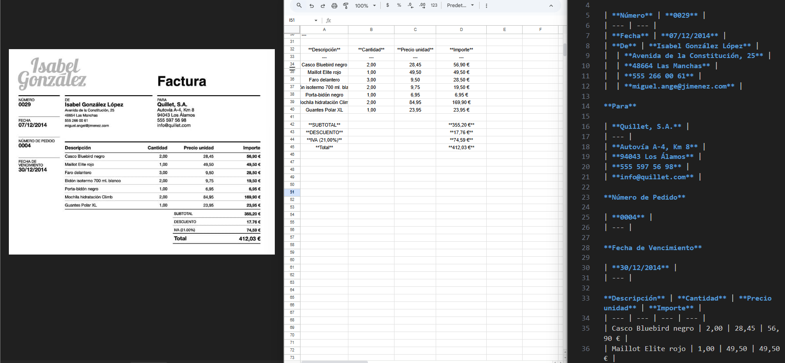

# Image to CSV Converter using Llama OCR

## Description
This project automates the conversion of image data into CSV format using Llama OCR and TableConvert API. It follows a two-step process:

1. Converts images to Markdown tables using Llama OCR
2. Transforms Markdown tables to CSV using TableConvert API

## Features
- OCR processing using Llama OCR
- Markdown table generation
- CSV conversion via TableConvert API
- Environment variable support for API keys
- Automatic file naming based on input images
- Showcase image:

- OCR processing using Llama OCR
- Markdown table generation
- CSV conversion via TableConvert API
- Environment variable support for API keys
- Automatic file naming based on input images

## Prerequisites
- Node.js
- npm

## Installation

### Configuration
Create a `.env` file in the root directory:

## Usage
1. Place your image in the project directory
2. Run the script:

## Project Structure

## Dependencies
- `llama-ocr`: Image to Markdown conversion
- `node-fetch`: API requests
- `form-data`: Form data handling
- `dotenv`: Environment variable management

## API Keys
- Llama OCR API key: [Llama OCR on npm](https://www.npmjs.com/package/llama-ocr)
- TableConvert API key: [TableConvert](https://tableconvert.com/)

## Note
- TableConvert API is optional. You can use the website directly at tableconvert.com. The API integration is used to automate and speed up the conversion process.

## Output
The script generates:

- `.md` file containing the Markdown table
- `.csv` file containing the final CSV data

## Error Handling
- Image processing errors
- API communication errors
- File system errors
